# qledger-cloudformation-deployment
CloudFormation templates with some PowerShell Core wrappers to help orcestrate deployment.

## Summary
The `qledger-production-deployment.yml` CloudFormation template creates the following resources:

  - VPC with the specified CIDR
  - 2 public subnets with specified CIDR
  - 2 private subnets with specified CIDR
  - internet gateway, route table, and default route for the route table
  - RDS PSQL database living in private subnet
  - ECS cluster living in public subnets, with 1 host in each public subnet
  - Load balancer routing to public subnets, a default targetting group, and a targetting group for the QLedger web service, and load balancer set up with round robin routing.
  - Security groups for RDS, LoadBalancer, and ECS hosts
  - Lambda function to manage autoscaling of ECS and SNS topic for the same purpose
  - Service with 2 'qledger' tasks that run the web server, with 1 container running per ECS host
  - CloudWatch logs for the containerized service
  
 The `qledger-static-prerequisites.yml` CloudFormation template creates the following resources:
 
  - A private S3 bucket, used to host the nested CloudFormation Templates defined in the `infrastructure` and `service` directories
  - An ECR repository for the QLedger container

In addition, these two templates can invoked via the PowerShell Core scripts `Deploy-QLedgerStaticResources` and `Deploy-QLedgerProductionDeployment` for the static resources and service deployment respectively. There is also a simple script to build and Deploy QLedger; this script is not needed if you wish to upload the container to the ECR repository yourself. All of these scripts are located in the `scripts` folder.

Finally, deployment settings are located in the `DeploymentSettings.json` file located in the `config` folders.

[Additional comments](#notes) from myself are available after usage instructions.

## How to use

### TL;DR (with default parameters)
- Make sure you have AWS CLI v2, git, PowerShell Core 6+, and Docker on your machine
- Clone this repo and https://github.com/RealImage/QLedger
- Set up an IAM user with sufficient permissions. See [Create IAM user](#iam-user) for more details
- run `aws configure` and input your access key, secret key, and region for the IAM user
- run `Deploy-QLedgerStaticResources.ps1`
- run `Publish-ContainerToEcr.ps1 -QLedgerGitRepositoryFullDirectoryPath <path-to-qledger-repository-on-local-filesystem> -AWSRegion <your-aws-region> -AWSAccountId <aws-account-id>`
- edit `./config/DeploymentSettings.json` with relevent settings. See [configuring deployment Settings](#deployment-settings) for more information. Make sure you change `DatabaseUsername`, `DatabasePassword`, `QLedgerContainerRepositoryUrl`, and `QLedgerApiToken`.
- run `Deploy-QLedgerProductionDeployment.ps1 -ConfigFilePath <path-to-DeploymentSettings.json>`
- validate service is working using any desired endpoints, base URL of service specified in the output of `Deploy-QLedgerProductionDeployment.ps1`

### Prepare your local environment
You will need to install the AWS CLI (2+), PowerShell Core (7 LTS), Git, and Docker on your machine. You may run into permission issues if the executing user does not have permission to use docker without the use of sudo/elevated permissions.
 
- [Git installation instructions](https://git-scm.com/book/en/v2/Getting-Started-Installing-Git/)
- [PowerShell Core installation instructions](https://docs.microsoft.com/en-us/powershell/scripting/install/installing-powershell?view=powershell-7)
- [AWS CLI installation instructions](https://docs.aws.amazon.com/cli/latest/userguide/cli-chap-install.html)
- [Docker installation instructions](https://docs.docker.com/get-docker/)

It is recommended that you virtualize your environment, to avoid having to make changes to your system in order to run anything. 
Your environment should have access to the internet.

Finally, [this repository](https://github.com/ekelundh/qledger-cloudformation-deployment) as well as the [QLedger repository](https://github.com/RealImage/QLedger) are required to be present in the environment.

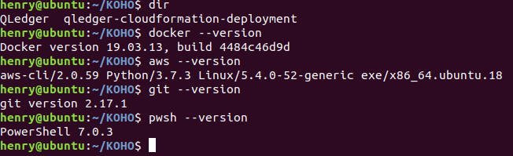

### Create IAM user

You will need an AWS IAM user in order to deploy QLedger.
Navigate to the IAM service in the AWS console, and hit create new user.
Select a username and set the access type to programmatic access, then hit next.
Attach the following policies to the user directly:

- AmazonRDSFullAccess
- AWSLambdaFullAccess
- IAMFullAccess
- AutoScalingFullAccess
- ElasticLoadBalancingFullAccess
- AmazonEC2ContainerRegistryFullAccess
- AmazonS3FullAccess
- AmazonECS_FullAccess
- AmazonVPCFullAccess
- AmazonSNSFullAccess

Optionally, you may tag this user with something useful in order to find it later.
Note down the access key ID and secret access key after creating the user. They will be needed for subsequent steps.
While you are here, note your AWS account ID, as that will also be used in later steps.

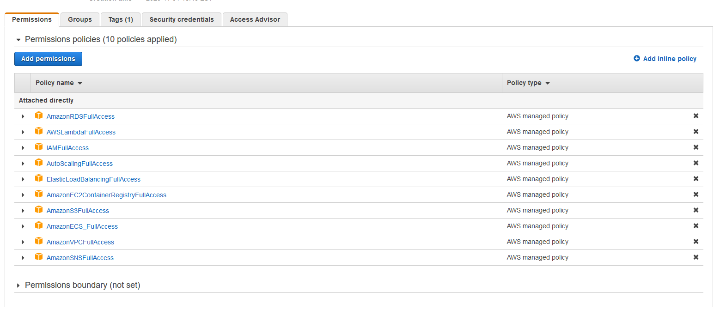

### Configuring AWS CLI
After creating an IAM user with the specified policies, configure the AWS CLI to use the access key and secret access key using the `aws configure` command. At this point you should also set up your region. It is not nessessary to select an output type.

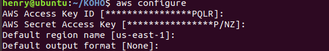

### Setting up static resources
At this point, you should run the command pwsh to enter into a PowerShell Core shell. While this is not explicitly needed, the command syntax for the following sections assumes you are using PowerShell Core, and it may be useful for reference.

There are two scripts that should be run in succession
The first script, `Deploy-QLedgerStaticResources.ps1`, should be run first. This script creates an S3 bucket and ECR repository.

From the `scripts` directory:
`.\Deploy-QLedgerStaticResources.ps1 -S3BucketName <desired-bucket-name> -ECRName <desired-ecr-repository-name>`

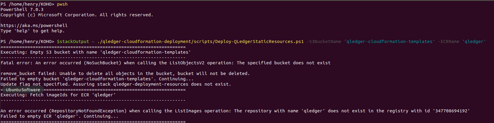

Note that the errors about failing to delete S3 bucket contents and ECR repository contents are expected when these do not yet exist.

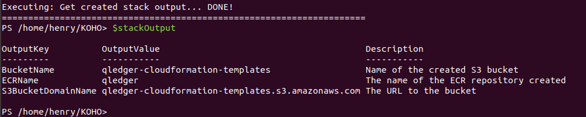

After creating these repositories, we need to upload our QLedger container to the created ECR repository.

`Publish-ContainerToEcr.ps1` is responsible for this.
Simply invoke this Cmdlet and it will build, tag and push your container to the specified ECR repository in the region and for the account specified.
The script will return a URL to the container uploaded, which you will need for the next section.
`$ECRContainerUrlWithTag = .\Publish-ContainerToEcr.ps1 -ECRName <ecr-repository-name> -QLedgerGitRepositoryFullDirectoryPath <path-to-qledger-repository-on-local-filesystem> -AWSRegion <your-aws-region> -AWSAccountId <aws-account-id>`
Note that the AWS Region parameter should be the one you set up with aws configure, and the ECR name should be the one passed to `Deploy-QLedgerStaticResources.ps1`

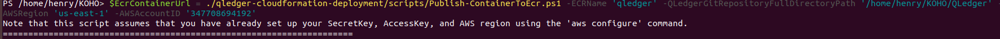

After this script is finished executing (note that the docker push command can take a bit of time as its sending a lot of data) you are done settings up the static resources.

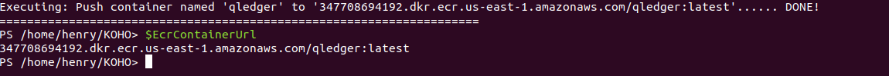

### Configuring deployment settings

Now that all the prerequisites are taken care of, navigate to `./config/DeploymentSettings.json` in this repository. You must now fill out all settings defined there.
If you are comfortable using the default subnets/vpc CIDRs, feel free to leave them as default. Otherwise, set them up such that all subnets are contained within the VPC CIDR.

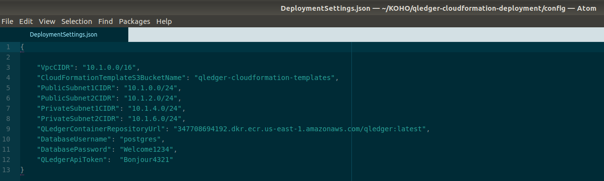

`DatabasePassword`, `DatabaseUsername`, and `QLedgerApiToken` should be changed from the default value there; in an ideal world some automation tool such as Jenkins would likely template those values in, or fetch them from the environment. Make sure you dont accidently commit them to git :)

Finally, `CloudFormationTemplateS3BucketName` should be the same as your `S3BucketName` parmeter for the `Deploy-QLedgerStaticResources.ps1` script, and `QLedgerContainerRepositoryUrl` should be equal to the output of `Publish-ContainerToEcr.ps1`, some variation of `<aws-account-id>.dkr.ecr.<region>.amazonaws.com/<ecr-name>:latest`. 

Both of these values will also be printed to console as part of the execution of the script.

### Deploying QLedger

After these values are put into your DeploymentSettigns.json file, simply invoke `Deploy-QLedgerProductionDeployment.ps1` with the specified deployment settings JSON:
`.\Deploy-QLedgerProductionDeployment.ps1 -ConfigFilePath <path-to-DeploymentSettings.json>` and wait for the stack to complete.

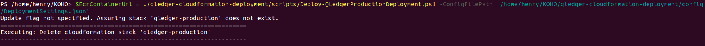

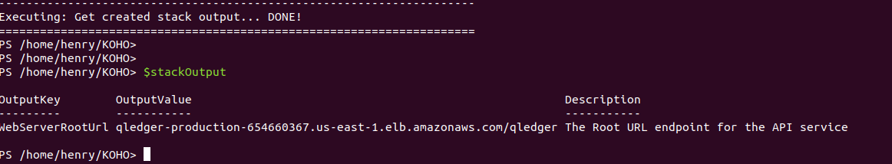

Upon stack creation completion, the output of the CloudFormation Template will be displayed into the console; here you will see the base URL for the service.
Feel free to call endpoints such as `/qledger/ping` or start to mess around with the state. Note that for any endpoint other than the ping endpoint, you will need to authenticate; please check the [QLedger repository](https://github.com/RealImage/QLedger) for more information.

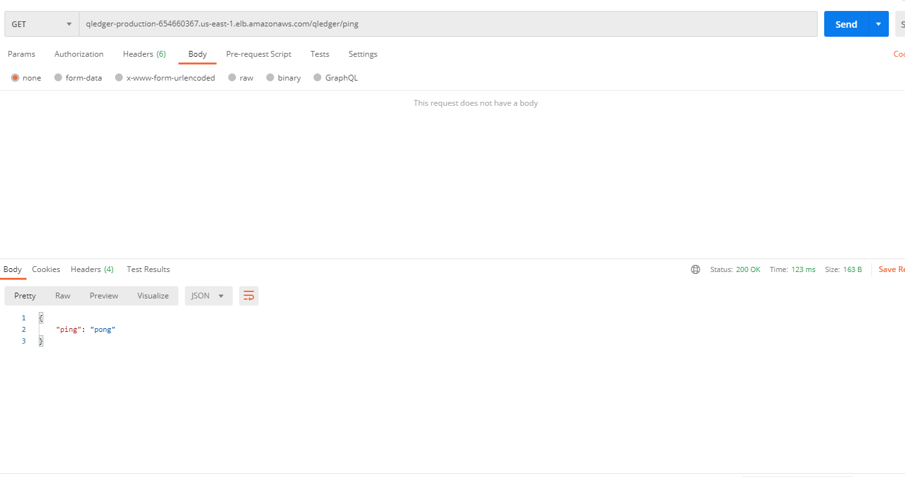

## Special Notes/Comments
- The PowerShell scripts are not particularly resilient to bad user input; the only check that is done is to make sure expected values exist.

- The permission set needed to execute this template is not ideal; I would have prefered to create a custom policy with the permissions I needed explicitly. That being said, in an isolated environement these permission set is not too terrible.

- The ECS cluster should ideally be in the private subnets, with NAT gateways set up for each of the subnets. However, NAT gateways are not part of AWS' "free tier" so I elected against it. Due the how the security groups are set up I do not think this is particuarly bad. For a similar reason, there is only one RDS instance.

- The UserData script for the ECS clusters has to install the cfn-init/cfn-signal utilities itself as the recommended container image does not provide these by default. I would have liked to bake my own layer on top of the recommended one but I felt like that was out of scope

- Instance types are not configurable via scripts, change CloudFormation template directly if you want to change it. This was done to avoid accidentially using an instance type that was not under the 'AWS Free Tier'.
